# Banking System – Full Stack Project

This repository contains a full-stack banking system project built to demonstrate authentication, role-based access, and core banking operations such as deposits, withdrawals, and customer management.

Currently, the frontend is hosted, while the backend and database are designed to be run locally for development and evaluation purposes.

## Tech Stack
### Frontend

1. React.js

2. Axios

3. Custom CSS

4. Hosted on Vercel

### Backend (Local)

1. Node.js

2. Express.js

3. JWT-based authentication (development setup)

4. bcrypt for password hashing

### Database (Local)

1. MySQL

## Live Demo

### Frontend URL:
https://banking-system-sigma-lime.vercel.app/

Note: The frontend requires the backend to be running locally in order to function fully.

## Project Structure
```
banking-system/
├── frontend/
│   ├── public/
│   ├── src/
│   │   ├── components/
│   │   ├── pages/
│   │   ├── services/
│   │   │   └── api.js
│   │   ├── App.js
│   │   └── index.js
│   └── package.json
│
├── backend/
│   ├── controllers/
│   ├── routes/
│   ├── models/
│   ├── db/
│   ├── app.js
│   ├── server.js
│   └── package.json
│
└── README.md
```

## Running the Project Locally
1. Clone the Repository
`git clone https://github.com/your-username/your-repo-name.git`
`cd banking-system`

2. Backend Setup
`cd backend`
`npm install`
`node server.js`


The backend will start on:

`http://localhost:5000`


The database configuration file is unchanged from the original local setup and connects to a local MySQL instance.

3. Database Setup

1. Create a MySQL database:

`CREATE DATABASE bank;`


2. Create the required tables:

`users`

`accounts`

`transactions`

3. Insert sample data manually or using existing SQL scripts.

### Important:

a. Passwords must be stored as bcrypt-hashed values

b. Plaintext passwords will not work with authentication

4. Frontend Setup (Optional for Local Testing)
`cd frontend`
`npm install`
`npm start`


Frontend will run at:

`http://localhost:3000`

5. API Configuration

The frontend is configured to send requests to:

`http://localhost:5000/api`


Ensure the backend is running before interacting with the hosted frontend.

## User Roles and Features
### Customer

2. Login

3. View account balance

4. Deposit money

5. Withdraw money

6. View transaction history

### Banker

1. Login

2. View all customers

3. View customer details

4. Update customer information

## Screenshots
### Database
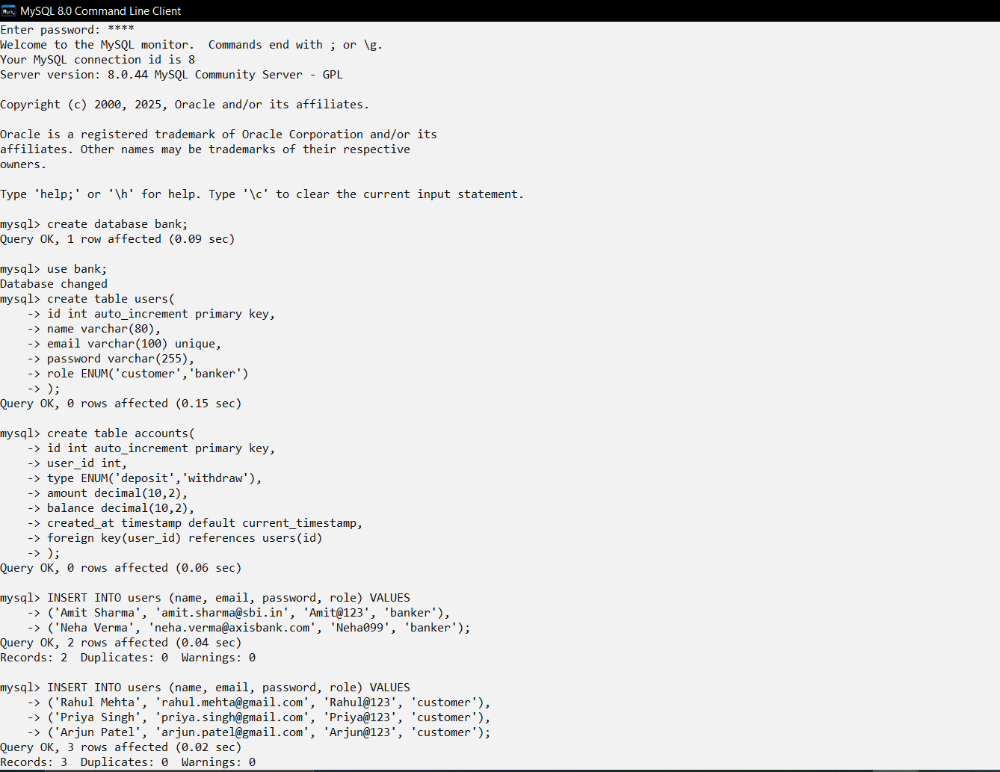
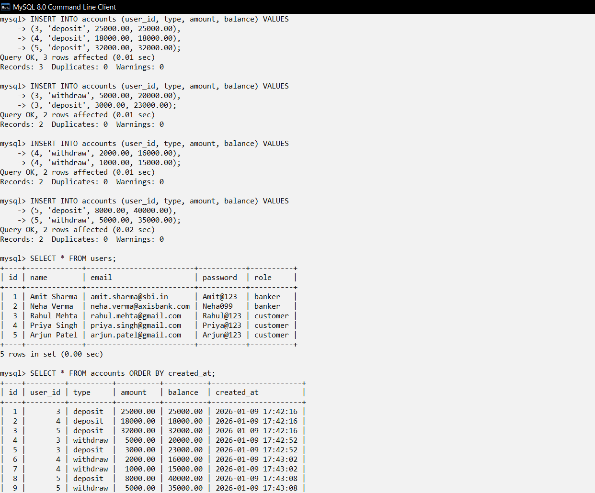
### Customer Side
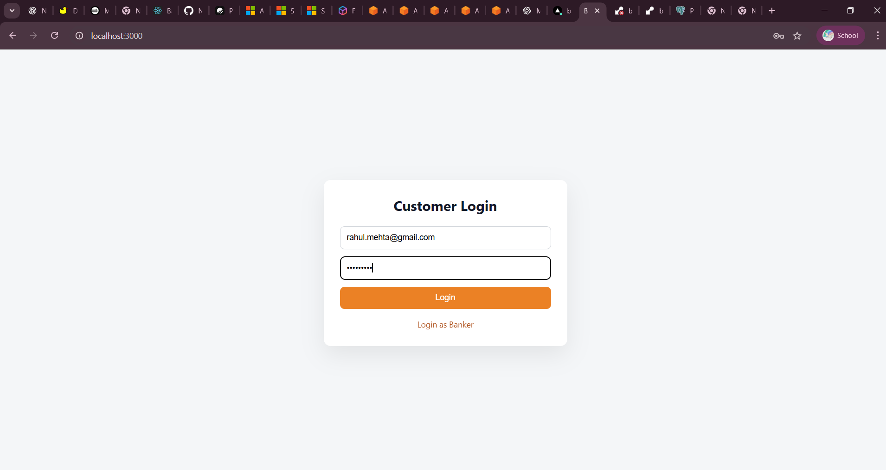
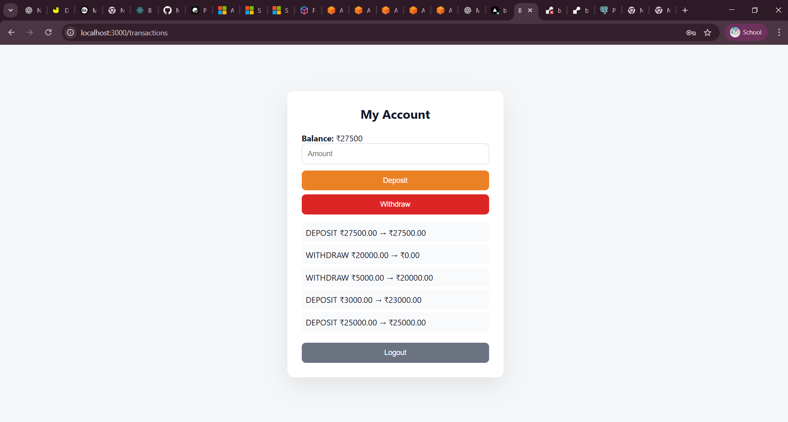
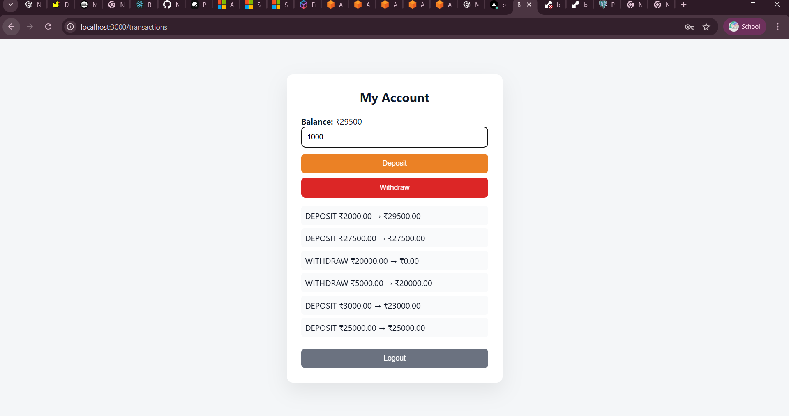
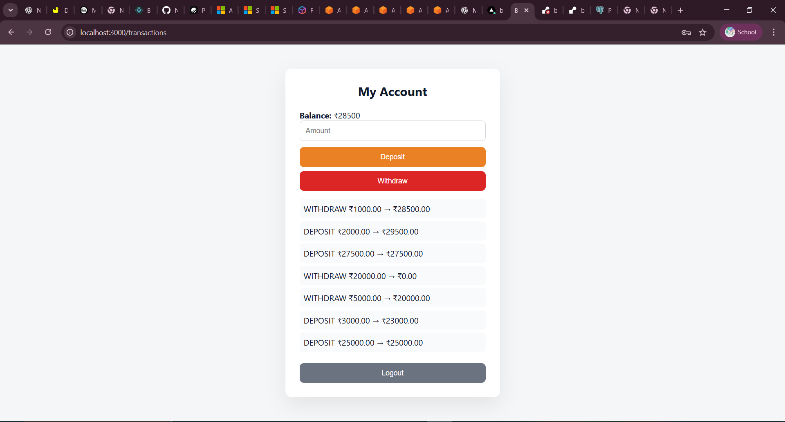
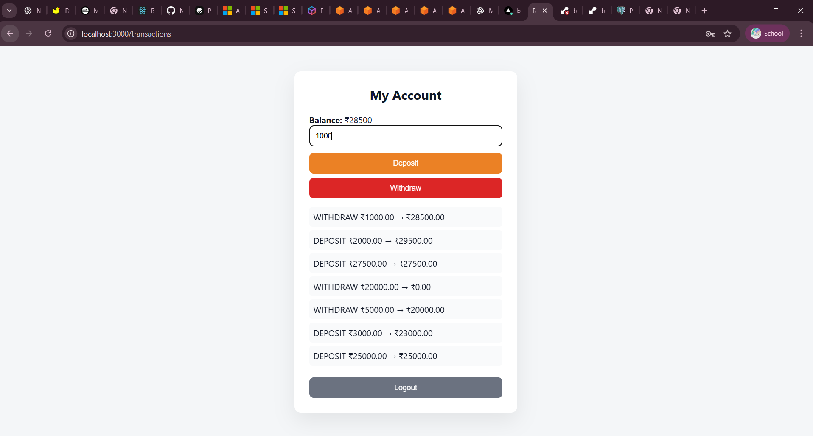
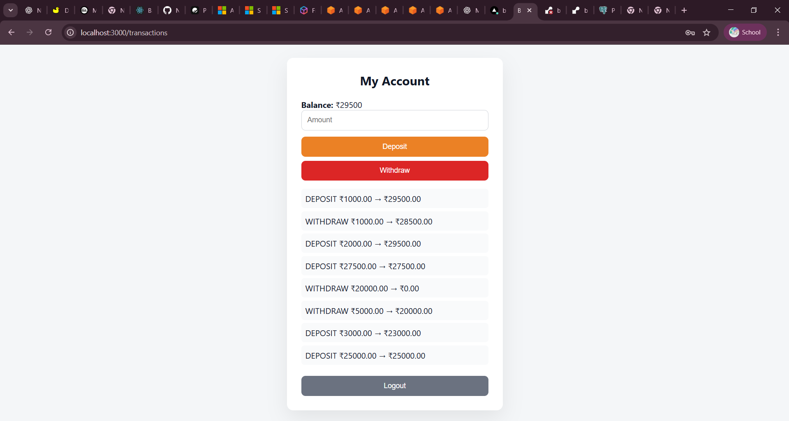
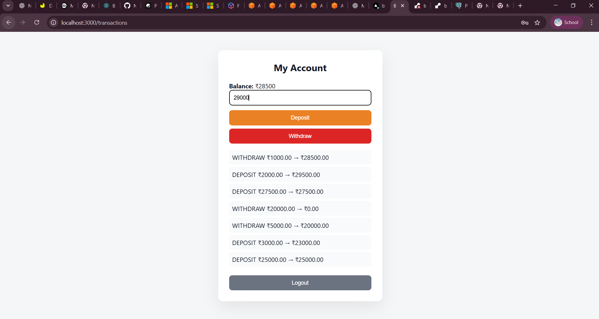
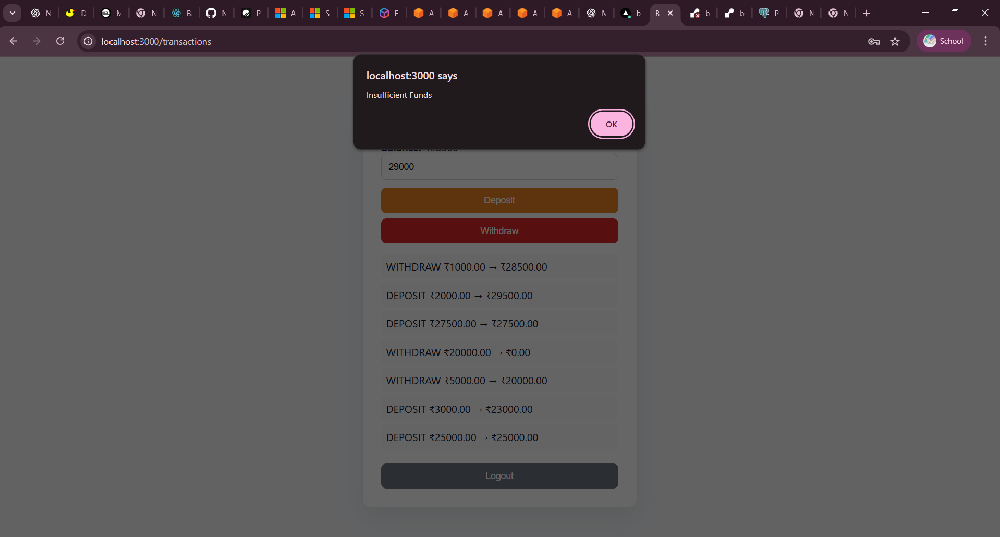

### Banker Side
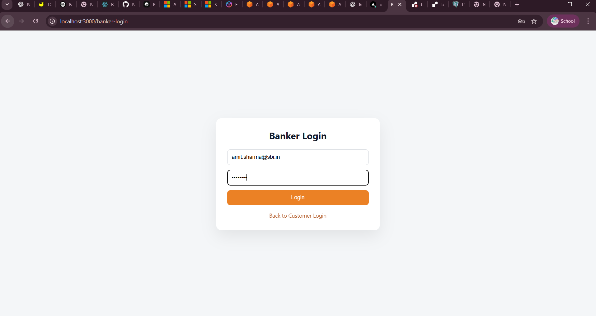
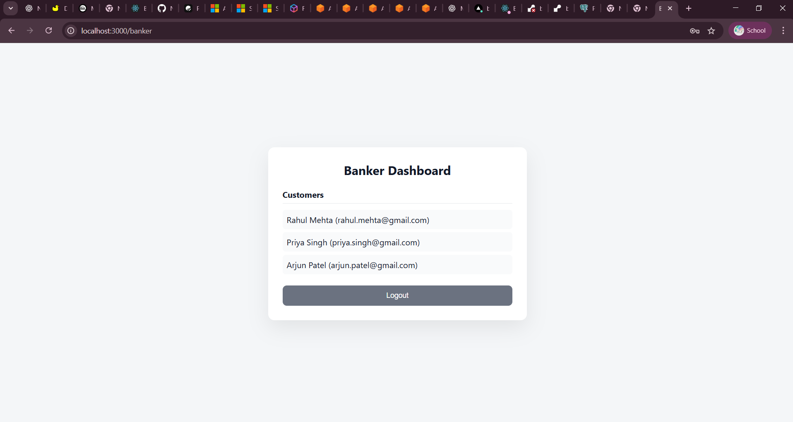
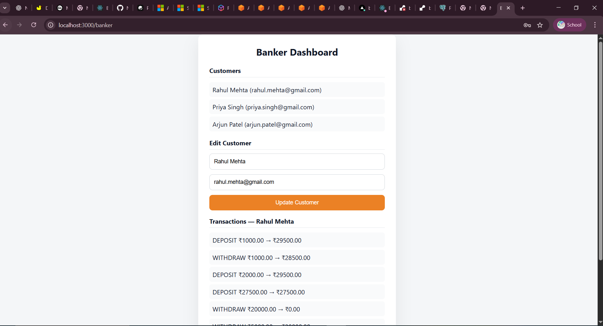
